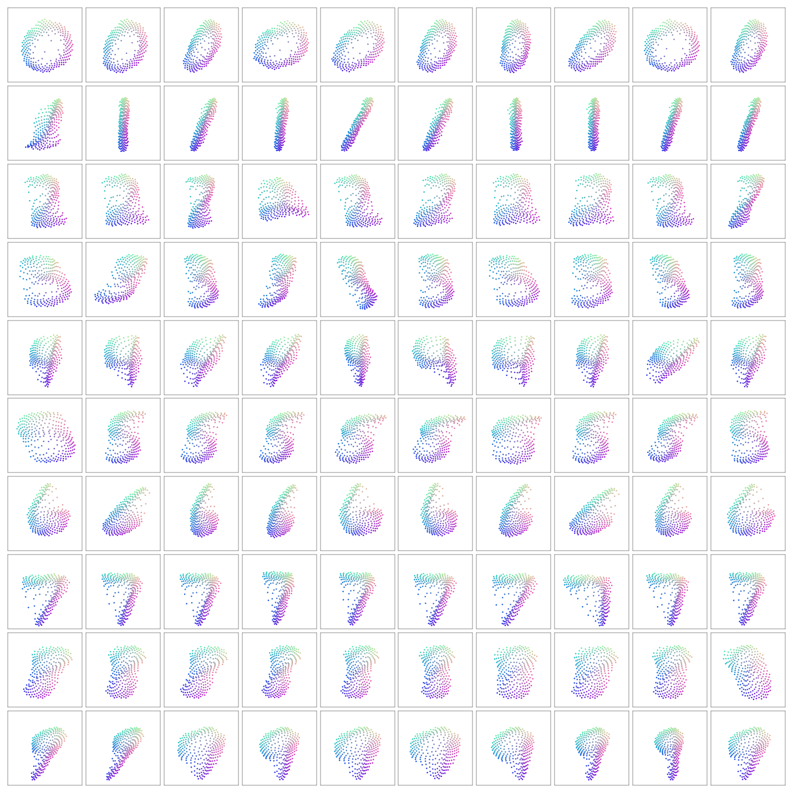
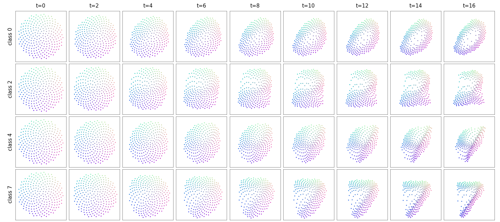
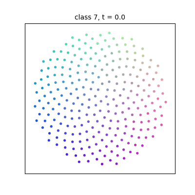

# v2: a swarm that settles into a digit

A weight-shared transformer block applied 16 times to a swarm of boids in R^6.
At t=0 the boids sit on a sunflower disk in the picture plane; when the swarm
settles, their positions form an MNIST digit. See [DESIGN.md](DESIGN.md) for
the reasoning behind the initial state — it is the whole design question.

## What a boid is

A point `(x, y, c1, c2, s1, s2)`:

- `(x, y)` — picture plane, `[-1, 1]^2`. Starts on a fixed sunflower disk, so boid #37 is always
  born in the same place. That is its identity; there is no positional encoding.
- `(c1, c2)` — the class code, one of ten fixed points on a circle. Identical for every boid at t=0.
- `(s1, s2)` — the style latent, `z ~ N(0, I)` at sampling time. Identical for every boid at t=0.

The hidden coordinates are the prompt. They are part of the habitat, every boid reads them
locally, and the block is free to write to them, so they also let trajectories cross in the
picture plane and can act as a clock.

## The block

Standard attention + feed-forward, residual-scaled by 0.1, no layer norm. Heads live in the full
6-D habitat and are averaged, as in v1. Output layers are zero-initialised so an untrained swarm
stands still. `swarm.py`.

## The loss

`splat_mmd`: the final cloud is rendered onto the 28x28 grid with a Gaussian kernel, the target
image's ink is blurred with the same kernel, and the two are compared in L2 — at three kernel
widths (0.75, 1.5, 3 px), each normalised by the target's energy. That is a multi-scale Gaussian
MMD between the boid measure and the ink measure: a proper distribution metric, no Chamfer-style
clumping. Boids outside the frame get no gradient from it, so there is a small out-of-frame hinge.

## Result of the first full run

`runs/final`: 64 boids, 2-layer FFN (69k swarm parameters), 20 epochs, ~37 min on an M1.
Test MMD 0.125 (v2 control 0.185; a perfect ink sample scores 0.077). Rendered at 256 boids,
every class is recognisable from the prior; within-class variation is slant, width and foot
shape. Strokes are still fat and 2/3/5/8 are the softest. `vis.py` also writes style-plane
sweeps, per-class trajectory GIFs and reconstructions into the run directory.







## Training

Class-conditional VAE. A small conv encoder maps the image to `q(s | image)`; the swarm decodes
`(class, s)`; KL to `N(0, I)` with a linear warm-up. The encoder is training-time scaffolding —
at sampling time the swarm is alone.

```bash
python train.py --run runs/base            # ~3 min/epoch on an M1, 10 epochs
python vis.py runs/base/best.pt             # samples.png, sweep_<c>.png, traj_<c>.gif, recon.png
```

The dynamics are permutation-equivariant and close to mean-field, so a swarm trained with 64
boids can be run with 256: `python vis.py runs/final/best.pt --n-boids 256`. On an M1 the cost
is purely the B·H·N² attention tensor, so training small and rendering big is the way to go.

## What the first round taught (64 boids, 3 epochs each, `compare.py`)

| run | test MMD | label sensitivity | note |
|---|---|---|---|
| control (6.9k-param swarm) | 0.185 | 0.061 | squashes the disk into a blob; class barely read |
| + pinned class code, radius 2 | 0.195 | 0.064 | no effect on its own |
| + 2-layer FFN (69k params) | **0.150** | **0.108** | hollow 0s, barred 7s appear in epoch 1 |
| same, sliced-Wasserstein loss instead of MMD | 0.213 | 0.039 | trails at equal time |

For reference, a perfect 128-point sample of the ink scores 0.077. Capacity of the per-step
field was the bottleneck, not the loss and not the conditioning. The style latent does leak
class-correlated shape (a nearest-centroid classifier on the 2-D style gets ~30-35%; 0s and
1s are round vs thin), which is partly legitimate style and partly the usual CVAE prior
mismatch — worth a higher KL weight later.
